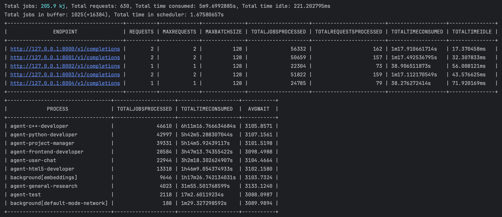

 # AgencyOS: A Computational Environment for AI Agents

AgencyOS is not an operating system for computer users, but rather a computational environment designed specifically for AI agents running on computing infrastructure. It's a Golang library and small wrapper around it - the server binary. The server acts as an orchestration platform providing agents with high-performance cached tools API, state of the art compute router, which supports routing requests to remote cloud GPUs, local GPUs, or even customer's own remote hardware.

A glimpse of what `top` output looks like:



Discord community: https://discord.gg/Runy3ueJZY

## Features

- High-performance multi-agent execution environment for mixed compute
- A set of tools to facilitate Monte-Carlo search in semantic spaces with real-world grounding, for laptops

## Notes on special features

- Automatic requests batching already hear, now with latency of 50ms, but we'll make this a tunable;
- Yes, we have a feature to force almost any model to output JSON, we have a fix for GPT-3.5-turbo even, open up an issue in case you feel you need it;
- Yes, we have a toolset for extracting successful inference paths (to facilitate **synthetic training dataset** creations for specific tasks, in fact the system was build with this option in mind), if you need it - open an issue, we'll try to sort it out ASAP;
- Yes, there're remote server orchestration tools, which can be open sourced, we have a toolset for `vast.ai`, but almost any cloud provider can be integrated and supported with automatic nodes management;
- Yes, there is a way to automatically discover maximum batch size for given model, but it would require a benchmarking suite start-up mode - quite easy, but not a priority.

### Coming Soon

- Plugins to support automated or user-controlled rent of servers
- Internal vector storage and RAG APIs
- Console user interface
- Image support (yes, even in console...)

Combined with LLM request caching, tracking, tagging, tracing, AgencyOS offers a powerful computational environment for AI agents.

# Table of Contents
- [Features](#features)
- [Notes on special features](#notes-on-special-features)
  - [Coming Soon](#coming-soon)
- [Introduction](#introduction)
- [Getting Started](#getting-started)
- [Configuration file](#configuration-file)
- [Workflows](#workflows)
  - [Defining agents](#defining-agents)
    - [Simple generating agent](#simple-generating-agent)
- [Contributing](#contributing)
- [FAQ](#faq)
  - [How does AgencyOS differ from traditional operating systems?](#how-does-agencyos-differ-from-traditional-operating-systems)
  - [What are the benefits of using AgencyOS?](#what-are-the-benefits-of-using-agencyos)
  - [How can I stay updated on AgencyOS developments?](#how-can-i-stay-updated-on-agencyos-developments)
- [License](#license)

<a name="introduction"></a>

## Introduction

AgencyOS is a computational environment designed to support AI agents in their tasks by providing them with high-performance tools and compute resources. It's built on top of Golang library and server binary, offering an orchestration platform for efficient execution of agent tasks.

<a name="getting-started"></a>
## Getting Started

Soon!

<a name="contributing"></a>
## Configuration file

Example configuration file:

```yaml
database:
  type: mysql
  host: localhost
  port: 3306

tools:
  serp-api:
    token: ${SERP_API_TOKEN}
  proxy-crawl:
    token: ${PROXY_CRAWL_TOKEN}

compute:
  - endpoint: http://localhost:8001/v1/completions
    type: http-openai
    max-batch-size: 128 # in case of Mistral-7B and A6000 GPU, 48G
```

These days you'll have to copy it to `config.yaml` and fill to your best knowledge, later we might have some basic discovery for M1/M2/M3 Macs and GPU workstations.

## Workflows

### Defining agents

#### Simple generating agent

```yaml
- agent:
   name: Google search assistant
   input-sink: google-search-goals-sink
   prompt-based:
    prompt: >
     You are AI, your goal is to generate as many as possible google search keywords in order to get more understanding in the field of original goal: 
     
     Original goal from a team member: {{goal}}?

     First decide in which language to produce keywords in, and stick forever to that decision, this will make your results reliable. 

     Before generation, think about nuances, such as in what language or set of languages to search for, what team could be missing in their request, but what it would be definitely interested in to achieve their goal. Don't worry, take a deep breath and think step by step.

    response-format:
     thoughts: place your thoughts here
     criticism: constructive self-criticism
     language: thoughts on languages to produce keywords in
     keywords:
     - keywords in the language you've chosen
    life-cycle-type: single-shot
    life-cycle-length: 200
```

It's the most basic agent, with life cycle of `single-shot`, which means it runs and runs until it reaches desired number of successful runs. Success here means AgencyOS was able to parse its output.

Output format for an agent is given by a structure defined in `response-format`, and whatever agent's response will only be accepted as successful if it was in desired format and we have a special tool to address common JSON issues, including an option to employ the model itself(or a different model), to attempt to fix JSON in case Turing Machine style fixes didn't help, behold:

https://github.com/d0rc/agent-os/blob/main/tools/json-parser.go#L10

## Contributing

We welcome contributions from the community to improve and expand AgencyOS. If you're interested in contributing, please follow these steps:

1. Fork the repository on GitHub.
2. Create a new branch for your changes.
3. Make your modifications and ensure they pass all tests.
4. Submit a pull request describing your changes.

<a name="faq"></a>
## FAQ

### How does AgencyOS differ from traditional operating systems?

AgencyOS is not an operating system for computer users but rather a computational environment designed specifically for AI agents running on computing infrastructure. It provides high-performance tools and compute resources to support agent tasks.

### What are the benefits of using AgencyOS?

AgencyOS offers several benefits, including:

- High-performance multi-agent execution environment for mixed compute;
- A set of tools to facilitate Monte-Carlo search in semantic spaces with real-world grounding, for laptops;
- Compatibility with various compute resources (cloud GPUs, local GPUs, remote hardware);
- Local inference load balancer with caching, tooling and data lake APIs for LLMs research.

### How can I stay updated on AgencyOS developments?

You can follow the project's GitHub repository and join our community discussions to stay informed about new features, improvements, and updates.

<a name="license"></a>
## License

AgencyOS is released under the [MIT License](https://opensource.org/licenses/MIT).

---

That's it! This README.md provides an overview of AgencyOS, its features, and how to contribute. We look forward to your feedback and contributions to make this computational environment even better for AI agents.
