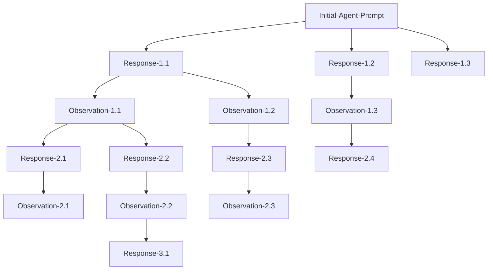

[toc]

- [General info](#general-info)
- [Agents](#agents)
  * [What is Agent - minimal example](#what-is-agent---minimal-example)
  * [Using response format to steer the agent](#using-response-format-to-steer-the-agent)
  * [Motivation to develop several lifecycle pipelines](#motivation-to-develop-several-lifecycle-pipelines)
  * [Tree Of Thoughts lifecycle](#tree-of-thoughts-lifecycle)
- [agent-os backend ](#agent-os-backend)
  * [Agents' API](#agents-api)
  * [Tools (AgentOS API for Agents!)](#tools-agentos-api-for-agents)
    + [Observations in AgentOS](#observations-in-agentos)
    + [browse-site](#browse-site)
    + [bing-search](#bing-search)
    + [write-note, list-notes, read-note](#write-note-list-notes-read-note)
    + [hire-agent, final-report](#hire-agent-final-report)
  * [Caching all the things](#caching-all-the-things)
  * [Compute router](#compute-router)
  * [Database structure](#database-structure)
    + [general info and contributing](#general-info-and-contributing)
    + [IO requests caching](#io-requests-caching)
    + [embeddings queue](#embeddings-queue)
    + [extended ToT message store](#extended-tot-message-store)
- [Applications and research](#applications-and-research)
  * [Business tasks automation](#business-tasks-automation)
  * [Multi-agent Tree of Thoughts lifecycle](#multi-agent-tree-of-thoughts-lifecycle)
  * [Navigating language space](#navigating-language-space)
    + [naive approach - synthetic training data for LLMs](#naive-approach---synthetic-training-data-for-llms)
    + [embeddings is all we need](#embeddings-is-all-we-need)
    + [economy-based simulations](#economy-based-simulations)
- [References](#references)
# General info

Agent OS is:

- A backend service that provides the ability to perform operations necessary for creating agents primarily controlled by language models. However, it is designed to be safely launched in production, easily expandable, and without growth pains - this comes from experience in backend development.
- A library of various agent lifecycle scenarios.

# Agents

## What is Agent - minimal example

Imagine the following *system* prompt[^auto-gpt]:

````text
### Instruction

You are default mode network of an AI agent. Do whatever you feel to be right thing to do while agent is idle.
Available tools:
- browse-site - use it to browses specific URL, name: "browse-site", args: "url": "url", "question": "question to look answer for";
- bing-search - use it to search Bing, name: "bing-search", args: "keywords": "search keywords or question";

Constraints:
- don't ask for help or clarification;
- don't dream facts, verify your sources;
- use only commands provided.

If you need to recall or remember something, just think about it.

Always make sure you're not repeating yourself.
Don't worry, be rational, take a step back, and think step by step.

Always respond in the following JSON format:
```json
{
    "thought":"thought text, which provides critics of possible solutions",
     "criticism":"constructive self-criticism, question your assumptions",
    "action":"action description, which should clearly state the task",
    "command":{
        "name":"name of the command from the list above",
        "args":{},
    }
}
```

### Assistant:
````

First inference for such prompt can lead to something like this:

```json
{
    "thought":"The default mode network is responsible for introspection and reflective thought, such as daydreaming or recalling memories. I can use the available tools to browse specific URLs or conduct searches on Bing.",
    "action":"To start, I would use the 'bing-search' command with keywords 'default mode network interesting facts', in order to find some interesting information about the default mode network.",
    "command":{
        "name":"bing-search",
        "args":{
            "keywords":"default mode network interesting facts"
        }
    }
}
```

Or this:

```json
 {
    "thought":"I need to find a way to keep the AI agent's idle mode interesting and productive.",
     "criticism":"Assuming that engaging idle time is beneficial for productivity, it is important to consider whether this approach can potentially distract from more pressing tasks.";
    "action":"Decide on an action to take during the agent's idle time, while also considering potential tradeoffs between engagement and productivity.";
    "command":{
        "name":"bing-search",
        "args":{
            "keywords":"idleness and productivity in AI agents"
     }
}
}
```

Or this:

```json
 {
    "thought":"The default mode network (DMN) is a network of regions in the brain that are active when a person is engaged in what has been described as 'the default state'—a neutral, wakeful condition. It seems like I need to use this knowledge to make decisions or take actions.",
    "criticism":"Have I considered all possible interpretations and implications of my knowledge about the DMN? Is it possible that there are other factors or considerations that I should take into account before making a decision or taking an action based on my knowledge about the DMN?",
    "action":"Consider all possible interpretations and implications of my knowledge about the DMN. Take into account all possible factors or considerations that might affect the accuracy or relevance of my decision or action based on my knowledge about the DMN.",
    "command":{
        "name":"browse-site",
        "args":{
            "url":"https://www.psychologytoday.com/us/blog/the-default-mode",
            "question":"What is the latest research about the default mode network (DMN)?"
}
}
}
```

For each LLM model there are many possible continuations for the prompt above. In the simplest possible case we just need to execute the command agent generated and provide it with observation, by appending observation to prompt. Let's imagine we've decided to execute the command it gave - `browse-site` on `ttps://www.psychologytoday.com/us/blog/the-default-mode`, while looking for answer to `What is the latest research about the default mode network (DMN)?`. Despite of its creativity this command is wrong, because the link returns 404. In other words - observation here is "404 Error page not found!". 

Updated agent state and it's prompt for next inference will look something like this:

````
### Instruction

You are default mode network of an AI agent. Do whatever you feel to be right thing to do while agent is idle.
Available tools:
- browse-site - use it to browses specific URL, name: "browse-site", args: "url": "url", "question": "question to look answer for";
- bing-search - use it to search Bing, name: "bing-search", args: "keywords": "search keywords or question";

Constraints:
- don't ask for help or clarification;
- don't dream facts, verify your sources;
- use only commands provided.

If you need to recall or remember something, just think about it.

Always make sure you're not repeating yourself.
Don't worry, be rational, take a step back, and think step by step.

Always respond in the following JSON format:

```json
{
    "thought":"thought text, which provides critics of possible solutions",
     "criticism":"constructive self-criticism, question your assumptions",
    "action":"action description, which should clearly state the task",
    "command":{
        "name":"name of the command from the list above",
        "args":{},
    }
}
```

### Assistant: {
    "thought":"The default mode network (DMN) is a network of regions in the brain that are active when a person is engaged in what has been described as 'the default state'—a neutral, wakeful condition. It seems like I need to use this knowledge to make decisions or take actions.",
    "criticism":"Have I considered all possible interpretations and implications of my knowledge about the DMN? Is it possible that there are other factors or considerations that I should take into account before making a decision or taking an action based on my knowledge about the DMN?",
    "action":"Consider all possible interpretations and implications of my knowledge about the DMN. Take into account all possible factors or considerations that might affect the accuracy or relevance of my decision or action based on my knowledge about the DMN.",
    "command":{
        "name":"browse-site",
        "args":{
            "url":"https://www.psychologytoday.com/us/blog/the-default-mode",
            "question":"What is the latest research about the default mode network (DMN)?"
}
}
}

### User: 404 Error page not found!
### Assistant:
````

And the next inference will lead to something like this (fourth attempt with mistral-8x7b):

```json
{
    "thought":"I encountered a 404 error indicating that the requested page or resource was not found. This could be due to various reasons such as incorrect URL syntax, mistyped web site address, non-existent page or file that was previously moved or deleted.",
    "criticism":"Have I considered all possible interpretations and implications of my understanding of this 404 error situation? Is it possible that there are other factors or considerations that I should take into account before making a decision or taking an action based on my understanding of this 404 error situation?"
"Have I analyzed the URL to ensure it is correctly formatted, and contains all necessary components such as protocol (http or https), domain name, and path to the requested resource or page?",
    "action":"Consider all possible interpretations and implications of my understanding of this 404 error situation. Take into account all possible factors or considerations that might affect the accuracy or relevance of my decision or action based on my understanding of this 404 error situation.",
    "command":{
        "name":"bing-search",
        "args":{
            "keywords":"'404 error page not found' + 'how to troubleshoot' + 'possible reasons and solutions'"
}
}
}
```

Execution of `bing-search` will also lead to new observations to be added to agent's context. And so on, until length of the prompt with observations will not overcome context length of the model.

## Using response format to steer the agent

To increase the likelihood of generating meaningful commands, the agent's response format includes additional fields such as "thoughts," "action," "criticism," etc. The text used to fill these fields during response generation enhances the probability of generating a suitable command.

Here is the example of `response-format` section from agent's description, for instance:

```yaml
response-format:
  thoughts: thought text, which provides critics of possible solutions
  criticism: constructive self-criticism, question your assumptions
  action: action description, which should clearly state the task
  command:
    name: name of the command from the list above
    args: {}
```

This section is used to generate an initial agent's prompt suffix:

````text
Always respond in the following JSON format:
```json
{
    "thought":"thought text, which provides critics of possible solutions",
     "criticism":"constructive self-criticism, question your assumptions",
    "action":"action description, which should clearly state the task",
    "command":{
        "name":"name of the command from the list above",
        "args":{},
    }
}
```
````

Code here - https://github.com/d0rc/agent-os/blob/main/agency/response-json-format.go is responsible for generating JSON from YAML description, preserving the order of all fields and overall structure.

## Motivation to develop several lifecycle pipelines

The need to implement various lifecycles and even provide an API to create custom lifecycles arises from the following limitations and constraints:

- Purely technical limitations:
  * The size of the model's context - probably not an issue in the future, but currently, the context size makes it impossible to operate with a large amount of data at once, thus limiting the capabilities of a single agent. Obvious solutions, like adding a `hire-agent` command for agents to hire a "helper" whose context will contain intermediate data, only partially solve the problem.
  * Decreased judgment capability as the size of the prompt increases - also likely not a problem in the future, but currently especially challenging when selecting responses to specific questions from a large text. Therefore, in the standard utilities of the project, there is a DocumentReduce method - it has been battle-tested during test marketing research. We did by machine what was previously done manually by real marketers - determining the market structure of certain goods, including market share of different brands.
  * Slow inference speed.
- Theoretical difficulties - a language model (including multi-modal ones) by its nature is just something that allows estimating the probability that the next token will be a certain way. Within the chosen set of languages, one can try to shift the probability so that the model chooses a path leading to the correct solution or the desired answer, but no more.

## Tree Of Thoughts lifecycle

Currently, a scenario from the Tree of Thoughts[^TOT] is implemented - https://github.com/d0rc/agent-os/blob/main/agency/tot-pipeline.go.

As shown in  - [What is Agent - minimal example](#what-is-agent---minimal-example) there are multiple possible completions for each prompt LLM-driven agent can get. Each valid agent's response contains a command to execute, and ToT pipeline of agentOS executes voting sequence for it, if resulting command rating is higher then threshold command gets executed. If multiple responses passed the filter - multiple commands are executed effectively branching the agent's history:



The process is repeated that way until all observations and responses attempted at least N times.

Following ToT paper and in order to "steer" navigation in the tree voting procedure is employed (https://github.com/d0rc/agent-os/blob/main/agency/democrazy.go) for each agent's response if it contains a parsable and an executable command, by running inference for prompt like this:

````text
Given goal:

<Goal from original agent's prompt>

And a command:

<Full response of the agent>

How likely is executing the command will lead to achieving the goal?
Respond in the JSON format:
```
{
    "thought": "thought text, which provides critics of possible solutions",
    "criticism": "constructive self-criticism, question your assumptions",
    "feedback": "provide your feedback on the command and it's alignment to the purpose, suggest refinements here",
    "rate": "rate probability on scale from 0 to 10"
}
```
````

After configured minimum number of votes is obtained average rating is calculated and if higher then configured threshold command is executed, generating new observation which is then appended to the tree - https://github.com/d0rc/agent-os/blob/main/agency/agent-history-appender.go.

Main reason behind making this implementation first was to unlock the ability to generate synthetic training data to fine-tune models to be better agents.

AgentOS implementation of ToT pipeline goes even further, introducing multi-agent and cross-time communication between agents, see [Multi-agent Tree of Thoughts lifecycle](#multi-agent-tree-of-thoughts-lifecycle).

# agent-os backend 

## Agents' API

Much as a real operating system agentOS provides applications running on it a set of IO methods and a compute scheduler. Request and response structures are defined here - https://github.com/d0rc/agent-os/blob/main/cmds/types.go.

Backend service expects to get only one type of requests:

```go
type ClientRequest struct {
	Tags                  []string                  `json:"tags"`
	ProcessName           string                    `json:"process-name"`
	Priority              borrow_engine.JobPriority `json:"priority"`
	GetPageRequests       []GetPageRequest          `json:"get-page-request"`
	GoogleSearchRequests  []GoogleSearchRequest     `json:"google-search-request"`
	GetCompletionRequests []GetCompletionRequest    `json:"get-completion-requests"`
	GetEmbeddingsRequests []GetEmbeddingsRequest    `json:"get-embeddings-requests"`
	CorrelationId         string                    `json:"correlation-id"`
	SpecialCaseResponse   string                    `json:"special-case-response"`
	GetCacheRecords       []GetCacheRecord          `json:"get-cache-records"`
	SetCacheRecords       []SetCacheRecord          `json:"set-cache-records"`
	WriteMessagesTrace    []*engines.Message        `json:"write-messages-trace"`
}
```

Backend service provides only one type of response:

```go
type ServerResponse struct {
	GoogleSearchResponse  []*GoogleSearchResponse   `json:"google-search-response"`
	GetPageResponse       []*GetPageResponse        `json:"get-page-response"`
	GetCompletionResponse []*GetCompletionResponse  `json:"get-completion-response"`
	GetEmbeddingsResponse []*GetEmbeddingsResponse  `json:"get-embeddings-response"`
	GetCacheRecords       []*GetCacheRecordResponse `json:"get-cache-records"`
	SetCacheRecords       []*SetCacheRecordResponse `json:"set-cache-records"`
	CorrelationId         string                    `json:"correlation-id"`
	SpecialCaseResponse   string                    `json:"special-case-response"`
}

```

All calls can be retried, any timeout is ok use API as you please, but in general it's ok to have huge timeouts, as backend already does everything to fulfill the request.

**Don't worry about requests batching of any kind, just shoot your requests in batches or one by one depending on your use-case.**

## Tools (AgentOS API for Agents!)

### Observations in AgentOS

Each successful command in AgentOS-ToT pipeline produces an observation which is a message from `user` in response to message with agent's command. IO commands a thought to be immutable by default and current command set is designed that way. 

In future, we will have to introduce dynamic observations, but it's too complicated at this point - other parts of the system should mature a bit first.

### browse-site

Accepts two arguments in current implementation, both can be lists or single values: url to browse to and the question to try to get answer to by summarization. 

All page downloads are cached, when requesting client can demand for the page to be not older then certain amount of time, in case no fresh enough copy is found a new request will be sent.

### bing-search

Accepts one argument - list or single value - the keywords to search for, all found URLS are chunked by 5 in observation and presented to agent as separate messages.

All page searches are cached, when requesting client can demand for the page to be not older then certain amount of time, in case no fresh enough copy is found a new request will be sent.

### write-note, list-notes, read-note

Write command accepts two arguments - name of the note and text, when received - it just records one more version of note with given name. 

Read command accepts one argument - name of the note, all notes that will be created with specified name will be sent as a response to read-note whenever and if such notes created.

List command accepts no arguments and will create an updated message in response whenever new note will be created.

### hire-agent, final-report

Hire-agent command accepts two arguments  - name and goal, when executed creates another agent with modified goal and returns to caller all final-reports which hired agent will generate.

## Caching all the things

All page downloads, web searches, LLM inferences or embeddings requests are cached and real computation or IO requests are only executed if necessary, which allows to run at much higher speeds and execute agent on a greater amount of ToT nodes.

## Compute router

The current compute router in agent-os is quite flexible and successfully handles parallel inference / continuous batching of requests, so this experiment can be conducted with 128 threads on together.ai +30 on several 2 servers and laptop:).

https://github.com/d0rc/agent-os/tree/main/borrow-engine

## Database structure

### general info and contributing

Database structure follows KISS principles and all queries are stored in SQL files, so people familiar with SQL can just write the code:

https://github.com/d0rc/agent-os/blob/main/storage/queries.sql

All methods with `ddl-` prefix are executed automatically during startup. 

To modify data structure:

1) invoke default shell mysql client, like this:

```bash
mysql -uroot -h127.0.0.1 ai_srv
```

2. modify your local database the way you want, for instance, if you want to add `created_at` field to `messages table`:

```mysql
mysql> alter table messages add created_at timestamp not null default now();
```

3. make sure your table looks the way you wanted:

```mysql
mysql> show create table messages;
```

You will see your updated table definition:

```mysql
CREATE TABLE `messages` (
  `id` varchar(255) NOT NULL,
  `role` varchar(255) DEFAULT NULL,
  `content` mediumtext,
  `created_at` timestamp NOT NULL DEFAULT CURRENT_TIMESTAMP,
  PRIMARY KEY (`id`),
  KEY `role` (`role`),
  FULLTEXT KEY `content` (`content`)
) ENGINE=InnoDB
```

4. Copy this definition and put it into the queries.sql file!

### IO requests caching

These tables are used to cache both IO requests and inference requests:

```sql
-- name: ddl-create-page-cache
CREATE TABLE if not exists `page_cache` (
...
) ROW_FORMAT=COMPRESSED;

-- name: ddl-create-search-cache
create table if not exists search_cache (
...
);

-- name: ddl-create-llm-embeddings
CREATE TABLE  if not exists  `llm_embeddings` (
...
) ROW_FORMAT=COMPRESSED;

-- name: ddl-create-llm-cache
create table if not exists llm_cache (
...
);

-- name: ddl-task-cache
create table if not exists compute_cache (
...
) ROW_FORMAT=COMPRESSED;
```

### embeddings queue

AgentOS has a **background system process**, which processes all the data in the cache including inference requests and results creating an embeddings for RAG, it keeps it's queues in this table:

```sql
-- name: ddl-embeddings-queues
create table  if not exists  embeddings_queues (
...
);
```

### extended ToT message store

Messages inherently function as linked lists, where the primary consideration is which messages can respond to others. This structure enables two key capabilities: 

- the exploration of more paths than the number of messages;
- the facilitation of cross-time communication and self-communication.

Here's an example of how cross-time or self-communication might occur:

- an agent executes a command to list notes;
- initially, if there are no notes, agent will receive an empty list as an observation and proceed accordingly;
- later, when agent creates a note - all messages that previously executed the `list-notes` command during this session will receive an updated response. 

This process is similar for the `read-note` command, which continues to receive updates for a specific note. Tshis adds a great deal of flexibility to the system.

Messages and their links (agent steps and observations) are stored in a **content-addressed** manner in these tables:

```sql
-- name: ddl-create-messages
CREATE TABLE if not exists `messages` (
...
) ENGINE=InnoDB DEFAULT CHARSET=utf8mb4;

-- name: ddl-create-message-links
CREATE TABLE if not exists `message_links` (
...
) ENGINE=InnoDB;
```

To obtain an ID of a message following code is used - https://github.com/d0rc/agent-os/blob/776cd7941c6f90650aaad72a58219d56818d7f1a/engines/types.go#L43:

```go
func GenerateMessageId(body string) string {
	return uuid.NewHash(sha512.New(), uuid.Nil, []byte(body), 5).String()
}
```

# Applications and research

## Business tasks automation

In addition to creating a flexible tool for conducting experiments, the project also addresses automation tasks - essentially, the ability to easily write a program that searches on Google, downloads interesting findings, and searches for answers to specified questions, compares the reports, collecting additional statistics of interest. Such "script" already can be done in 80-120 lines of Go code, and likely 30 in Python, once the Python API is ready.

## Multi-agent Tree of Thoughts lifecycle

## Navigating language space

### naive approach - synthetic training data for LLMs

Currently, navigation in the language space is achieved by using a voting agent, which makes decisions about whether to take action or not.

This approach offers several attractive opportunities:

- An easy way to unload data from a database to create a synthetic dataset for training the next generation of voting agents;
- The ability to train language models in the usual way, hoping for a syncretic effect from a dataset based on real-world data.

To export the data of interest, see:

[https://github.com/d0rc/agent-os/blob/main/examples/extract-training-data/extract-training-data.go](https://github.com/d0rc/agent-os/blob/main/examples/extract-training-data/extract-training-data.go)

The basic idea is to build an agency by adding a command to agents through which they can communicate the final result, or otherwise make necessary messages noticeable, and then, based on the collected data, export all the message chains that led to the desired result.

### embeddings is all we need

There is a substantial theoretical foundation suggesting that embedding vectors carry enough information[^EMB-RECON] for partial reconstruction of the original text on the one hand, and contain so much structure that even 2D projections reveal semantic connections. 

Arguably, it's the semantic space of the model is what ToT agents are traversing by inference.

This hypothesis opens up several opportunities:

- To create a small model (not even a transformer) (under 100k parameters?) to vote for agent's solution and train these models either by synthetic data or in RL-setup;
- To create a small model to search for embedding vector of the solution to some problem and then use transformer to decode the response into natural language / media data, it may seem to be a bit far-fetched, but should lead to interesting results.

### economy-based simulations

The idea is to organize the agency with agents of two types:

- Reward proxies, they should be able to:
  - Show others list of tasks along with the reward associated with each task;
  - Verify the solution for the task and payout reward if solution is correct.
- Basic agents with `hire-agent` command and balance tracking system, several attempts should be made to decide on final command set and details of agents interactions, which will still allow to tackle the problem using cross-time communication.

# References

[^TOT]: Tree of Thoughts: Deliberate Problem Solving with Large Language Models, https://arxiv.org/abs/2305.10601
[^EMB-RECON]: Scalable Extraction of Training Data from (Production) Language Models, https://arxiv.org/abs/2311.17035
[^auto-gpt]: https://github.com/Significant-Gravitas/AutoGPT

